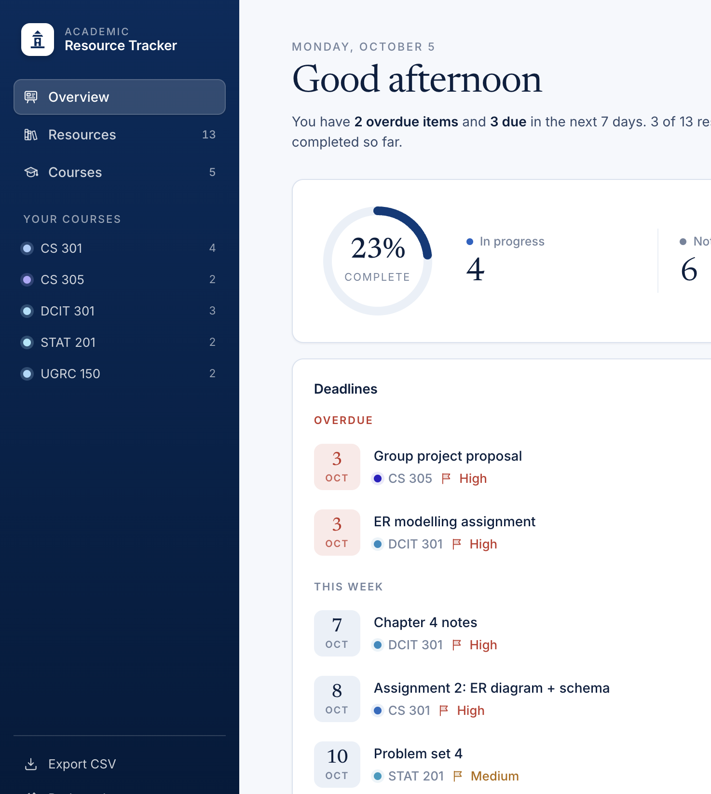
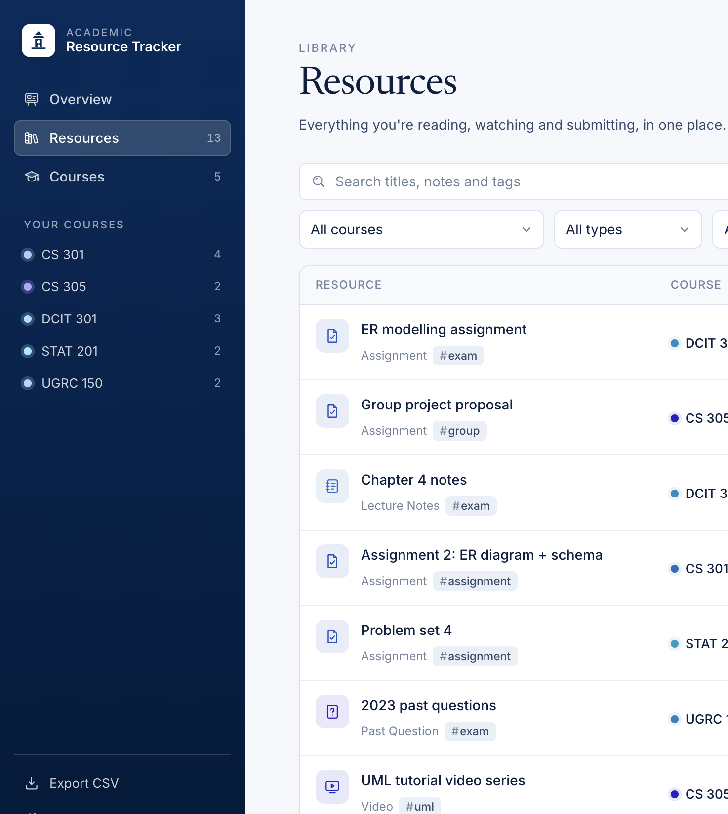
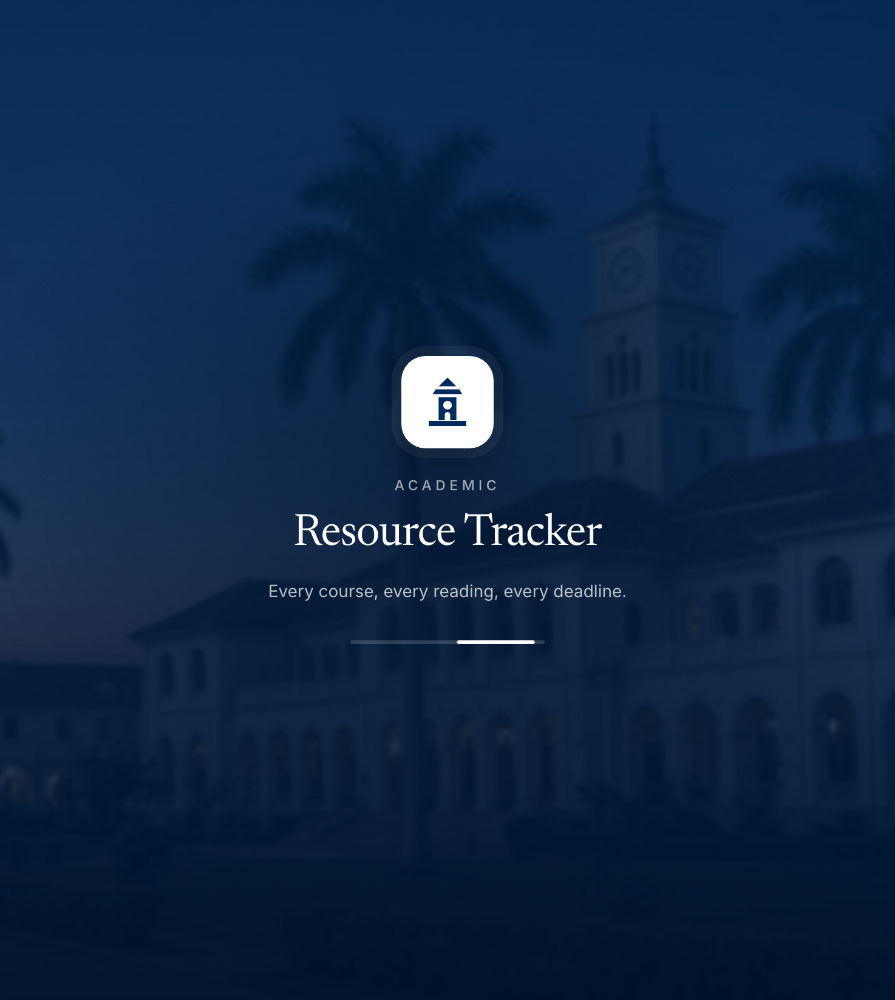
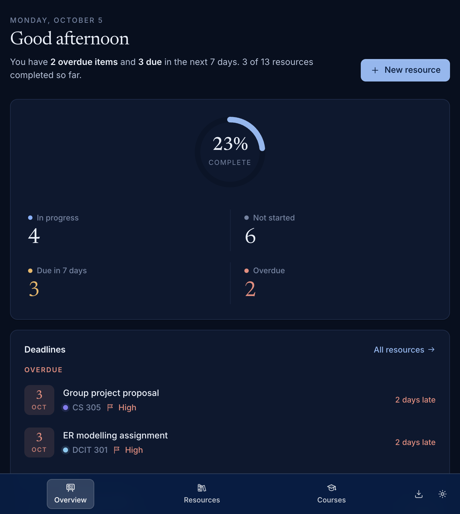

<div align="center">

# Student Academic Resource Tracker

**Every course, every reading, every deadline.**

A web app for university students to organise study materials, assignments and deadlines for each course,
with a dashboard that shows exactly what's overdue, what's due this week and how far along each course is.

Built with C# and ASP.NET Core 8, styled in University of Ghana navy and white.


[Features](#features) · [Screenshots](#screenshots) · [Quick start](#quick-start) · [API](#rest-api) ·
[Deployment](#deployment) · [Full documentation](docs/DOCUMENTATION.md)

</div>

---

## Table of contents

- [Why this exists](#why-this-exists)
- [Features](#features)
- [Screenshots](#screenshots)
- [Tech stack](#tech-stack)
- [Quick start](#quick-start)
- [Configuration](#configuration)
- [How it works](#how-it-works)
- [Project layout](#project-layout)
- [Data model](#data-model)
- [REST API](#rest-api)
- [Design](#design)
- [Testing](#testing)
- [Deployment](#deployment)
- [Security](#security)
- [Limitations and roadmap](#limitations-and-roadmap)
- [Troubleshooting](#troubleshooting)
- [Documentation](#documentation)

## Why this exists

Over a semester, course material piles up in many places: lecture slides on one site, past questions in a group
chat, textbook chapters, YouTube playlists and assignment briefs. This app gives every one of them a home under
the right course, with a status, a priority and a due date, so you can see at a glance what to work on next.

## Features

**Courses**
- Add, edit and delete courses with a code, title, lecturer and semester.
- Each course card shows its progress bar, resource count and overdue items.
- Deleting a course asks for confirmation and tells you how many resources go with it.

**Resources**
- Eight types: lecture notes, textbooks, videos, articles, assignments, past questions, links and other.
- Status (Not started, In progress, Completed), priority (Low, Medium, High), due date, link, tags and notes.
- Change status straight from the list with a status pill, without opening a form.

**Finding things**
- Status tabs with live counts.
- Filters for course, type, priority and *overdue only*.
- Search across titles, notes and tags.

**Dashboard**
- A greeting with a one-line summary, for example "You have 2 overdue items and 3 due in the next 7 days".
- A completion ring and counts for in progress, not started, due this week and overdue.
- A deadline timeline grouped into *Overdue*, *This week* and *Later*. Click an item to edit it.
- Progress per course, library mix by type, and open items by priority.

**Everything else**
- CSV export that opens cleanly in Excel.
- A branded splash screen while the app loads.
- Light and dark themes (follows your device, with a toggle that's remembered).
- Phone layout with a bottom navigation bar.
- Keyboard shortcuts: <kbd>/</kbd> search, <kbd>N</kbd> new resource, <kbd>Esc</kbd> close a dialog.
- Sample data on first run, so the dashboard is never empty.

## Screenshots

| Overview | Resources |
|---|---|
|  |  |

| Splash screen | Dark mode on a narrow screen |
|---|---|
|  |  |

## Tech stack

| Layer | Technology |
|---|---|
| Backend | C#, ASP.NET Core 8 Minimal API |
| Storage | One JSON file (`Data/tracker.json`) with locking and crash-safe saves |
| Frontend | HTML, CSS and plain JavaScript (no framework, no build step) |
| Fonts | Inter for text, Newsreader for headings |
| Tests | xUnit with `WebApplicationFactory` for in-process API tests |
| Container | Multi-stage Docker build on the official .NET 8 images |
| Hosting | Render, via the `render.yaml` blueprint |

## Quick start

### Requirements

- [.NET 8 SDK](https://dotnet.microsoft.com/download/dotnet/8.0). Check with `dotnet --version`; it should print 8.x.
- Git and a modern browser. Internet access is only needed once, for the automatic package restore.

### Run it

```bash
# 1. Clone the repository
git clone https://github.com/FelixAshong/StudentResourceTracker-c-.git StudentResourceTracker
cd StudentResourceTracker

# 2. Start the app
dotnet run
```

Open the URL printed in the terminal (for example `http://localhost:5000`). Stop the app with `Ctrl + C`.

On the first run the app creates `Data/tracker.json` with three sample courses and eight resources.

**From an IDE:** open `StudentResourceTracker.csproj` in Visual Studio, VS Code (C# Dev Kit) or Rider and press **F5**.

### Run with Docker

```bash
docker build -t student-resource-tracker .
docker run -p 8080:8080 -v "$PWD/Data:/app/Data" student-resource-tracker
# then open http://localhost:8080
```

The `-v` option keeps your data in the local `Data` folder between runs.

## Configuration

Nothing needs configuring to run locally. These options are available:

| Setting | Example | Effect |
|---|---|---|
| `--urls` | `dotnet run --urls http://localhost:5080` | Use a specific port |
| `DataFile` | `dotnet run --DataFile=/path/to/tracker.json` | Store data somewhere else (also works as an environment variable) |
| `PORT` | `PORT=8080 dotnet run` | Listen on all interfaces on that port; set automatically by Render |

**Reset the data:** stop the app and delete `Data/tracker.json`. Sample data is recreated on the next run.
**Back up:** copy `Data/tracker.json`.

## How it works

```
Browser  (wwwroot: index.html + app.js + styles.css)
   |  JSON over HTTP  (/api/...)
ASP.NET Core 8 Minimal API  (Program.cs)
   |  DataStore.Read / DataStore.Write
JSON data file  (Data/tracker.json)
```

One ASP.NET Core app serves both the API and the front end, so there's a single thing to run and deploy.

- **Validation:** every request is checked on the server (`Services/Validators.cs`). Errors come back as a 400
  with a message per field, which the form shows above its buttons.
- **Saving:** `Services/DataStore.cs` locks around every change, writes to a temporary file and swaps it in, so a
  crash can't corrupt your data. If a change fails part-way, it is rolled back.
- **Recovery:** if the data file can't be read at startup, it is renamed to `tracker.corrupt-<timestamp>.json`
  and the app starts fresh, so nothing is lost.
- **Dashboard:** `Services/AnalyticsService.cs` calculates all the dashboard figures on the server.

## Project layout

```
StudentResourceTracker/
├── Program.cs                         App startup + all REST endpoints
├── StudentResourceTracker.csproj
├── Models/
│   ├── Entities.cs                    Course, StudyResource, enums, DataFile
│   └── Dtos.cs                        Request and response records
├── Services/
│   ├── DataStore.cs                   JSON persistence (locking, atomic saves, rollback)
│   ├── AnalyticsService.cs            Dashboard calculations
│   ├── Validators.cs                  Input validation
│   ├── BadRequestExceptionHandler.cs  Malformed requests -> readable 400s
│   └── SeedData.cs                    First-run sample data
├── wwwroot/
│   ├── index.html                     Layout, splash screen, dialogs, custom icon set
│   ├── app.js                         Routing, rendering and API calls
│   └── styles.css                     Design system (UG theme, light and dark)
├── tests/StudentResourceTracker.Tests/  31 xUnit unit and API tests
├── docs/
│   ├── DOCUMENTATION.md               Full documentation
│   ├── StudentResourceTracker_Documentation.pdf
│   └── images/                        Screenshots used in this README
├── Dockerfile                         Container image
└── render.yaml                        Render deployment blueprint
```

## Data model

**Course:** `code` (required, unique), `title` (required), `lecturer`, `semester`.

**Resource:**

| Field | Values |
|---|---|
| `courseId` | The course it belongs to (required) |
| `title` | Required, up to 200 characters |
| `type` | `LectureNotes`, `Textbook`, `Video`, `Article`, `Assignment`, `PastQuestion`, `Link`, `Other` |
| `status` | `NotStarted`, `InProgress`, `Completed` |
| `priority` | `Low`, `Medium`, `High` |
| `dueDate` | Optional, `YYYY-MM-DD` |
| `url` | Optional, `http://` or `https://` only |
| `tags` | Up to 10, lower-cased, duplicates removed |
| `notes` | Optional, up to 2000 characters |

A resource is **overdue** when its due date has passed and it isn't completed. Deleting a course deletes its
resources. Full field rules are in [section 7 of the documentation](docs/DOCUMENTATION.md#7-data-design).

## REST API

| Method | Route | Purpose |
|---|---|---|
| GET | `/api/courses` | List courses with resource counts |
| POST | `/api/courses` | Create a course |
| PUT | `/api/courses/{id}` | Update a course |
| DELETE | `/api/courses/{id}` | Delete a course and its resources |
| GET | `/api/resources?courseId=&type=&status=&priority=&q=&overdue=` | List, filter and search |
| POST | `/api/resources` | Create a resource |
| PUT | `/api/resources/{id}` | Update a resource |
| PATCH | `/api/resources/{id}/status` | Change status only |
| DELETE | `/api/resources/{id}` | Delete a resource |
| GET | `/api/analytics/summary` | Dashboard figures |
| GET | `/api/export/csv` | CSV download |
| GET | `/healthz` | Health check |

Example:

```bash
curl -X POST http://localhost:5000/api/resources \
  -H "Content-Type: application/json" \
  -d '{"courseId":"<course id>","title":"Clean Code","type":"Textbook",
       "status":"NotStarted","priority":"High","dueDate":"2026-11-15","tags":["reading"]}'
```

Errors: `400` for validation problems (with a message per field), `404` for unknown ids, `409` for a duplicate
course code. The dashboard response, CSV columns and more examples are in
[section 8 of the documentation](docs/DOCUMENTATION.md#8-api-reference).

## Design

- **Colours:** University of Ghana Legon navy (`#002B5C`) and white. Course and type colours are all shades of
  blue; red, amber and green are kept only for overdue, due soon and completed.
- **Logo:** a simple clock tower inspired by the Legon campus. The official university crest is not used, as it
  is the university's trademark.
- **Icons:** a custom hand-drawn SVG set with a soft tinted fill, one for each page and resource type.
- **Splash screen:** shown until the first data load finishes (at least 0.9 seconds, at most 8 seconds).
- **Accessibility:** labelled buttons, screen-reader announcements, keyboard shortcuts, and no animation when the
  device asks for reduced motion.

## Testing

```bash
dotnet test tests/StudentResourceTracker.Tests
```

31 tests cover validation, saving and rollback, corrupt-file recovery, dashboard calculations and every API
endpoint. The API tests run the real app in-process against a temporary data file, so your own
`Data/tracker.json` is never touched.

## Deployment

The app runs on [Render](https://render.com) as a Docker web service, configured by `render.yaml`.

[](https://render.com/deploy?repo=https://github.com/FelixAshong/StudentResourceTracker-c-)

1. In the Render dashboard choose **New → Blueprint** (or use the button above).
2. Connect this repository; keep branch `main` and blueprint path `render.yaml`.
3. Name the blueprint and click **Deploy Blueprint**.
4. Open **Resources → student-resource-tracker**. When it shows **Live**, the `https://….onrender.com` link at
   the top opens the app.

Every push to `main` redeploys automatically.

> **Free plan note:** the free plan has no permanent disk, so data resets to the sample data whenever the service
> restarts or redeploys. It also sleeps after about 15 minutes idle, so the first visit afterwards can take up to
> a minute (the splash screen covers the wait). For permanent data, add a persistent disk on a paid plan and set
> `DataFile` to a path on it, or move storage to a database.

## Security

- All user text is HTML-escaped before it reaches the page (no XSS).
- Links must be `http` or `https` and open with `rel="noopener noreferrer"`.
- CSV cells that start with `=`, `+`, `-` or `@` are neutralised to prevent spreadsheet formula injection.
- All input is validated on the server.
- The Docker container runs as a non-root user.
- There is no login: the app is designed for one student. See the documentation for how to add accounts.

## Limitations and roadmap

**Current limitations:** single user with no login; one JSON file for storage; data resets on the free Render
plan; no file uploads or reminders.

**Ideas for next steps:**
- [ ] Move storage to a database (EF Core with SQLite or PostgreSQL). Only `DataStore` needs replacing.
- [ ] Student accounts with per-user data.
- [ ] Upload PDFs and notes to each resource.
- [ ] Deadline reminders by email or browser notification.
- [ ] Export deadlines to Google or Outlook Calendar (`.ics`).
- [ ] Import courses and resources from CSV.

## Troubleshooting

| Problem | Fix |
|---|---|
| `dotnet` is not recognised | Install the .NET 8 SDK and reopen the terminal |
| "You must install .NET to run this application" | Install the .NET 8 SDK, not just the runtime |
| Port already in use | `dotnet run --urls http://localhost:5080` |
| Blank page | Run from the project folder so `wwwroot` is found |
| Old styles after an update | Hard-refresh: `Cmd + Shift + R` (Mac) or `Ctrl + F5` (Windows) |
| Want to start over | Stop the app and delete `Data/tracker.json` |
| A `tracker.corrupt-….json` file appeared | The data file was damaged; its original content is in that file |
| Deployed site is slow to open | The free Render service was asleep; wait for the first load |
| Deployed data disappeared | Expected on the free Render plan after a restart or redeploy |

## Documentation

- [Full documentation](docs/DOCUMENTATION.md): architecture, configuration, data design, complete API reference,
  design system, testing, deployment, security, limitations and troubleshooting.
- [PDF version](docs/StudentResourceTracker_Documentation.pdf) of the same document.
